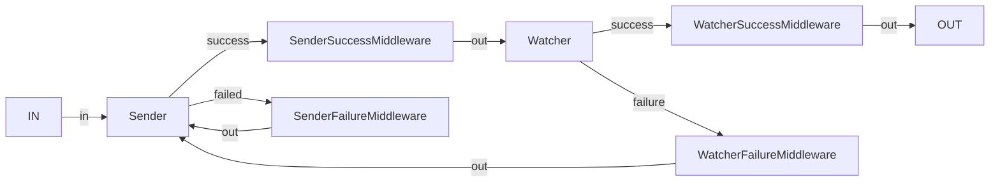

# Requester

`requester` is a part of the Band SDK designed to help simplify the development of software looking to send oracle
requests to BandChain, a decentralized oracle network in blockchain technology.

## Features

- **Simple Request Handling:** The `requester` package simplifies the process of creating and submitting requests to
  BandChain.
  You can create new requests and submit them to the BandChain with just a few lines of code.

- **Response Handling:** Besides handling requests, the `requester` package also provides tools to manage the responses
  coming from BandChain. 
  This includes error handling, retry logic, and more.

## Usage

### Sender

We can set up a sender using the following code:

```go
senderCh := make(chan sender.Task, 100)
s, err := sender.NewSender(
client,
logger,
senderCh,
successChBufferSize,
failureChBufferSize,
gasPrice,
keyring
)
```

where when we want to request a new oracle request, we can send a new task to `senderCh` and get the successful
and failed transactions from `s.SuccessRequestsCh()` and `s.FailedRequestsCh()` respectively.

### Watcher

As the sender only checks whether the transaction has been successfully made or not, we can use the watcher to check
whether the request itself has resolved on-chain.

We can set up a watcher using the following code:

```go
watcherCh := make(chan watcher.Task, 100)
w, err := watcher.NewWatcher(
client,
logger,
pollingDelay,
timeout,
successChBufferSize,
failureChBufferSize,
)
```

where we can send a new task to `watcherCh` and get the successful and failed requests from `w.SuccessRequestsCh()`
and `w.FailedRequestsCh()` respectively.

### Middleware

To handle the flow of information between the Sender and Watcher and to handle cases where we want to implement
any logic in between the two systems, we can implement middleware in between the system to do so.

For example, the graph below shows a possible middleware flow where we want to send a request and have some logic in
retrying if the request fails for a specific reason.



##### Handler

The sdk provides the following generic handlers that can be set in sequence in the middleware:

- Delay: To delay the request
- Retry: To retry the request up to a certain number of times

The sdk also provides the following handlers to be used for specifically with the sender:

- Gas: To bump insufficient gas

##### Parser

The middleware also contains a parser, where we can parse the output coming from the middleware to allow any receiver to
handle the output. A parser to parse the output from the sender to the watcher is provided as part of the sdk.

### Examples

For more detailed examples, please refer to the [examples'](./examples) directory.
